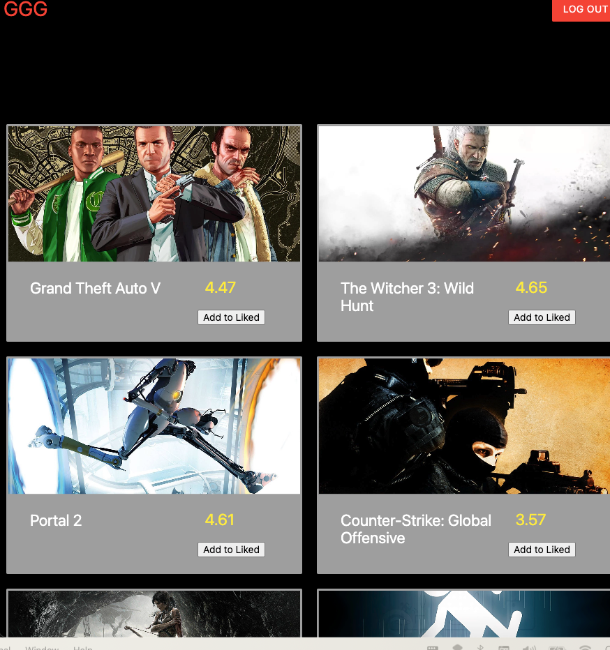
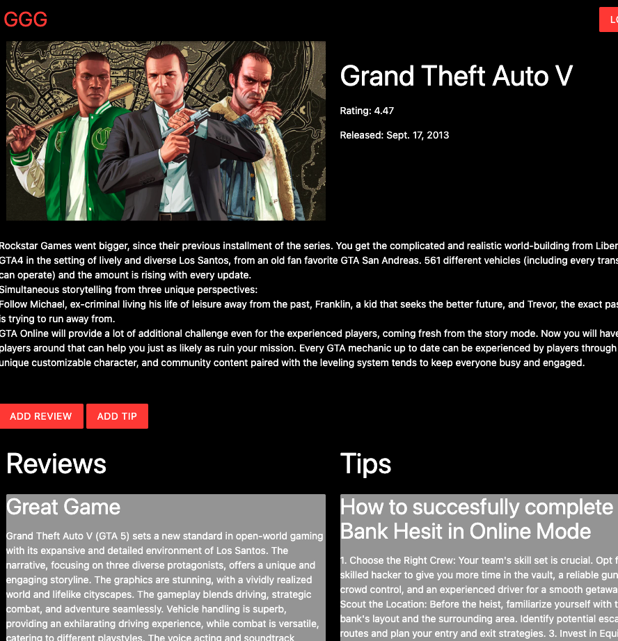

# GoodGameGaming

## App Title
GoodGameGaming - A Modern Gaming Review and Tips Platform

## Description
GoodGameGaming is an innovative web application designed for gaming enthusiasts. It offers a comprehensive platform for users to explore, review, and share tips about their favorite video games. The application features a user-friendly interface, integrating gaming news, reviews, and community discussions.

## Screenshot(s)

*Add more screenshots if necessary, and replace `path_to_landing_page_screenshot.png` with the actual file path of your screenshot.*

## Technologies Used
- **Django:** A high-level Python Web framework that encourages rapid development and clean, pragmatic design.
- **Python:** A programming language that lets you work quickly and integrate systems more effectively.
- **MaterializeCss:** A modern responsive front-end framework based on Material Design.
- **PostgreSQL (psql):** A powerful, open source object-relational database system.
- **Heroku:** A cloud platform as a service supporting several programming languages.

## Getting Started
- **Deployed App:** [GoodGameGaming Live](https://goodgamegaming-dfd0a2474432.herokuapp.com/games/)
- **Trello Board:** [Project Planning](https://trello.com/b/5v6nQg2V/project-3-planning)

## Next Steps
- Correctly implement add to liked functionality (add game to users liked-games field)
- Show in user profile view, all the liked games
- implemnt filter by genre game index
- fix some styling

## Deploy Locally
- Clone this Repo
- In your terminal cd into the root of the cloned repo and run the following line `python3 manage.py runserver`

## User Flow
- User create edit and delete game tips and read game tips from other users
- User create and delete game reviews and read game reviews from other users
